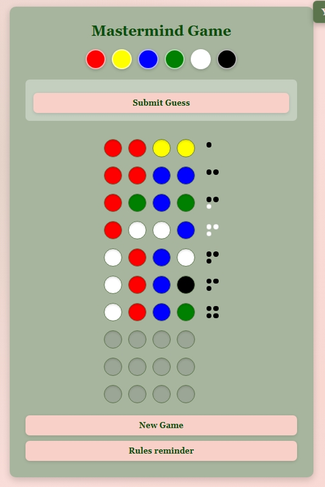
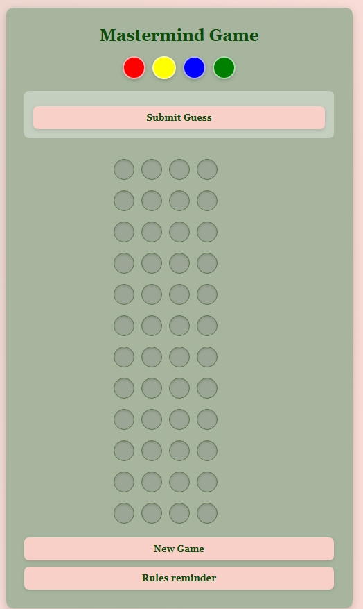
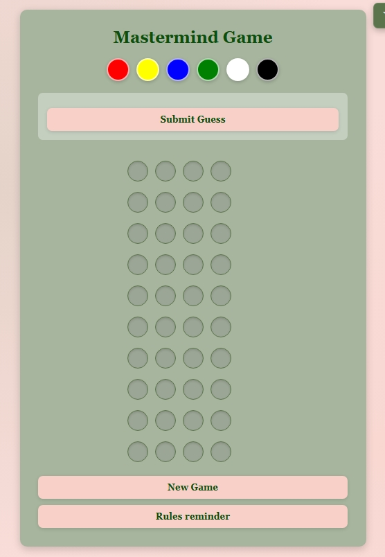
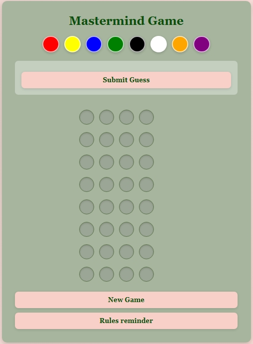

# MasterMind 


Un jeu web FullStack — une API REST en FastAPI connectée à un frontend HTML/CSS/JS, avec authentification JWT, base de données PostgreSQL et suite de tests complète.

[Jouer en ligne](https://mastermind.jenny-dev.com)

**Stack Technique:** 

Backend: FastAPI, PostgreSQL, SQLAlchemy, JWT Auth

Frontend: HTML, CSS, JavaScript

Outils: Docker, Pytest, Git, Alembic

## Architecture

Le projet est organisé en trois couches :

- API (FastAPI) : gestion des routes et validation
- Logique métier : fonctions pures dans `game_logic.py`
- Accès aux données : modèles SQLAlchemy (User → Game → Move)

## Le jeu en bref:

Le Mastermind est un célèbre jeu dans lequel le but est de trouver une combinaison secrète de couleurs.
Les règles : Le joueur doit deviner quelles couleurs sont dans la combinaison et dans quel ordre. Pour cela, il teste des combinaisons et reçoit un feedback après chaque essai.


### Les Feedbacks:
 - Jeton blanc → bonne couleur, mauvais emplacement
 - Jeton noir → bonne couleur, bon emplacement
 - Aucun jeton → rien ne correspond
- ⚫⚫⚫⚫ 4 jetons noirs → le joueur gagne la partie !

### Exemple de partie gagnante:


### Les niveaux:
J’ai décidé de créer 3 niveaux différents:

| Niveau | Couleurs disponibles | Tours maximum |
|--------|---------------------|---------------|
| Facile | 4 | 12 |
| Moyen | 6 | 10 |
| Difficile | 8 | 8 |


| Partie niveau facile | Partie niveau moyen | Partie niveau difficile |
|----------------------|---------------------|--------------------------|
|  |  |  |

### Système de score

Le score dépend :
- de la difficulté (multiplicateur)
- du nombre de tours utilisés

Formule :
(max_turns - turn_number + 1) × 10 × multiplicateur

Multiplicateurs :
- easy ×1
- medium ×2
- hard ×3

## Fonctionnalités
- Inscription et connexion sécurisée (JWT)
- Créer une partie selon le niveau désiré (facile, moyen ou difficile)
- Jouer un coup et obtenir le feedback en temps réel
- Score calculé à la fin de chaque partie (plus c'est difficile et rapide, plus le score est élevé)
- Affichage du meilleur score personnel

## Pourquoi ce projet ?
Ce projet est un projet d'apprentissage avec trois objectifs :
- Construire une API REST complète
- Connecter cette API avec un frontend
- Déployer le projet


-------


## Installation:

### Prérequis
- Python 3.11+
- Docker 

```bash
#  Cloner le repo
git clone https://github.com/jenny-sau/mastermind-api
cd mastermind-api

# Installer les dépendances
pip install -r requirements.txt

# Lancer la base de données
docker compose up -d

# Lancer le serveur
uvicorn main:app --reload
```

## Déploiement

- **Backend** : déployé sur [Railway](https://web-production-75841.up.railway.app/docs) avec PostgreSQL
- **Frontend** : déployé sur [Netlify](https://69a844cfb1413af03b11a7c7--heartfelt-snickerdoodle-4d0028.netlify.app/)
- **Domaine** : `mastermind.jenny-dev.com`


## Routes API

| Méthode | Route | Description |
|---------|-------|-------------|
| POST | `/auth/signup` | Créer un compte |
| POST | `/auth/login` | Se connecter |
| POST | `/game/create` | Créer une partie |
| POST | `/game/{id}/move` | Jouer un coup |
| GET | `/game/{id}` | État d'une partie |
| GET | `/game/{id}/moves` | Historique des coups |
| GET | `/games` | Toutes mes parties |


### Amélioration possible futur
- Permettre au joueur de consulter ses statistiques
- Support mobile amélioré

## Tests:
```bash
pytest
```
30 tests couvrant l'authentification, les routes jeu et la logique métier.

